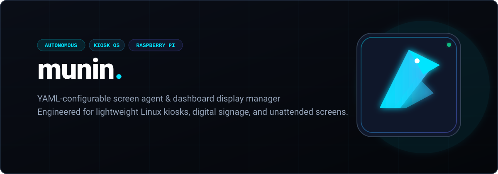

<p align="center">
  
</p>

<p align="center">
  <a href="https://github.com/naueramant/munin/actions/workflows/ci.yaml"></a>
  <a href="https://github.com/naueramant/munin/releases"></a>
  <a href="https://golang.org"></a>
  <a href="LICENSE"></a>
  <a href="#"></a>
  <a href="#"></a>
</p>

<p align="center">
  <strong>Autonomous, GitOps-ready screen agent & dashboard kiosk manager.</strong><br>
  Turn any Raspberry Pi or Linux machine into a reliable, unattended display in 60 seconds.
</p>

<p align="center">
  <a href="#-quick-start">Quick Start</a> •
  <a href="#-key-features">Features</a> •
  <a href="#-simple-configuration">Configuration</a> •
  <a href="#-gitops-fleet">GitOps Fleet</a> •
  <a href="#-documentation">Documentation</a>
</p>

---

## 💡 Why Munin?

Setting up wall monitors, NOC dashboards, or office displays shouldn't require fragile shell scripts, simulated `xdotool` keypresses, or heavyweight digital signage platforms with monthly fees.

**Munin** is a single lightweight Go binary (<15 MB) designed specifically for unattended kiosks:
- **Chrome DevTools Protocol (CDP) native**: Real browser control with clean tab cycling, background refresh, and automatic retry on network drops.
- **GitOps-driven**: Manage 1 or 100+ screens from a single Git repo. Push to `main` and screens sync, reconfigure, and refresh automatically.
- **Hardware-aware TV control**: Native HDMI-CEC commands turn screens on and off automatically and recover standby state after reboots.
- **Rootless & self-healing**: Runs entirely under unprivileged `systemd --user` with built-in diagnostics (`munin doctor --fix`).

> *Named after **Munin** ("memory"), one of Odin's twin ravens in Norse mythology who flies across the realm gathering information and bringing it back.*

---

## ✨ Key Features

- ⚡ **Lightweight & Fast**: Single compiled Go binary (<30 MB RAM). Ideal for Raspberry Pi Zero 2 W, 3, 4, 5, and Linux mini-PCs.
- 🖥️ **Native Chromium Automation**: Controls Chromium via Chrome DevTools Protocol — smooth tab rotation, per-tab display duration, and background reload without fake keystrokes.
- 🌐 **GitOps Fleet Management**: Manage all screens from one Git repository with SSH deploy keys, periodic sync, and local offline caching.
- 🔌 **HDMI-CEC Display Power**: Turn TVs on/off and schedule reboots via cron or simple `"07:00"` syntax, featuring smart post-reboot standby recovery.
- 💉 **Custom CSS & JS Injection**: Hide navigation bars, apply dark mode themes, or inject custom telemetry into third-party dashboards.
- 🔐 **HTTP Basic Auth**: Native support for password-protected internal dashboards without exposing credentials in URLs.
- 🛠️ **Local Standalone Mode**: Run without Git using a local `screen.yaml` with automatic hot reload on file edits.
- 🩺 **Self-Healing Diagnostics**: `munin doctor --fix` audits hardware permissions, GPU acceleration, and systemd services with one-click auto-repair.
- 🚀 **Automated Updates**: Keeps itself up to date seamlessly in the background directly from GitHub Releases.

---

## ⚡ Quick Start

### 1. One-Line Install

Install Munin and prerequisites (`chromium`, `cec-utils`, `cron`, `unclutter`) with a single command:

```bash
curl -fsSL https://raw.githubusercontent.com/naueramant/munin/master/install.sh | bash
```

### 2. Interactive Setup Wizard

Run the setup wizard to configure your screen in seconds:

```bash
munin init
```

The wizard configures your operating mode (Git Fleet or Local Standalone), sets up SSH deploy keys, enables auto-updates, and creates the systemd user service.

### 3. Check Service Status

Munin runs as a standard `systemd` user service without root privileges:

```bash
systemctl --user status munin
```

---

## ⚙️ Simple Configuration

Screen behavior is defined in a clean, human-readable `screen.yaml`:

```yaml
syntax: v1

# Fullscreen tabs to cycle through
tabs:
  - url: "https://grafana.company.internal/d/ops-overview?kiosk"
    duration: 45 # Display for 45 seconds
    reload: true # Background refresh on every cycle
    css: "styles/clean-grafana.css" # Inject CSS to hide navigation bars

  - url: "https://status.datadoghq.com"
    duration: 20

  - url: "https://metrics.internal.local"
    duration: 30
    auth:
      username: "kiosk"
      password: "secretpassword"

# Display power & maintenance schedule
power:
  screen_on: "07:00"    # Turn on TV at 07:00 (or cron: "0 7 * * 1-5")
  screen_off: "19:00"   # TV standby at 19:00 (or cron: "0 19 * * 1-5")
  reboot: "03:00"       # Nightly restart (preserves TV standby after boot)
  cec_device: 0         # Standard TV CEC address
```

> 💡 **Local Standalone Mode**: No Git needed! Run `munin --config screen.yaml`. Whenever you save edits to `screen.yaml`, Munin automatically hot-reloads the screen in real time.

---

## 🌐 GitOps Fleet

Manage all displays across offices, NOCs, and meeting rooms from a single Git repository:

```
my-screens-repo/
├── screens/
│   ├── reception-lobby/
│   │   └── screen.yaml          <-- Welcome board & visitor calendar
│   ├── noc-wall-01/
│   │   ├── screen.yaml          <-- Rotating Grafana & Datadog tabs
│   │   └── overrides.css        <-- Custom dark theme overrides
│   └── cafeteria-menu/
│       └── screen.yaml          <-- Daily menu & announcements
└── shared/
    └── branding.css             <-- Shared company stylesheet
```

- **Version Controlled**: Review dashboard URL changes and schedule modifications via standard Pull Requests.
- **Offline Resilient**: Local caching ensures screens keep running uninterrupted even if the network or Wi-Fi drops.
- **Self-Healing**: Run `munin doctor --fix` at any time to verify and repair hardware permissions, display sessions, and services.

---

## 📚 Documentation

Comprehensive guides and references are available in the [`docs/`](docs/) directory:

| Guide | Description |
| :--- | :--- |
| 🚀 **[Getting Started](docs/getting_started.md)** | Step-by-step installation, building from source, Raspberry Pi OS setup, and service management |
| ⚙️ **[Configuration Reference](docs/configuration.md)** | Complete YAML specification for `agent.yaml` and `screen.yaml` with all options |
| 🌐 **[Git Sync & Fleet Management](docs/git_sync.md)** | Managing multi-screen deployments, deploy keys, branch/folder tracking, and offline caching |
| 🔌 **[Screen Power & Native Cron](docs/cron_and_power.md)** | HDMI-CEC display power management, CEC device selection, and scheduled reboots |
| 🔄 **[Automatic Updates](docs/auto_update.md)** | GitHub Releases auto-update mechanism and scheduling |
| 💻 **[CLI Reference](docs/cli_reference.md)** | Complete subcommand and flag reference (`init`, `doctor`, `power-check`, `remove`) |
| 📁 **[Examples Directory](examples/)** | Ready-to-use production configs for standalone screens and multi-display fleets |

---

## 📄 License

Munin is open-source software licensed under the [MIT License](LICENSE).
